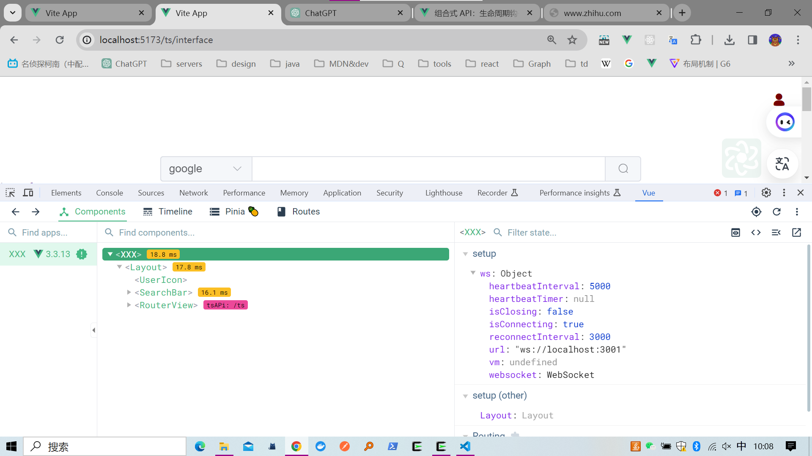

# 给组件命名

## 1.写两个 `script` 标签 

```vue
<script setup lang="ts">
import Layout from '@/components/layout/Layout.vue'
import Ws from '@/utils/websocket.js'
const ws = new Ws('ws://localhost:3001')

document.addEventListener('websocketMessage', (event) => {
  console.log(event);
  
  
})
</script>
<script lang="ts">
export default {
  name: 'XXX'
}
</script>
<template>
  <Layout />
</template>
<style>
#app {
  min-height: 100vh;
}
</style>

```

## 2. 使用插件

vite-plugin-vue-setup-extend

# 